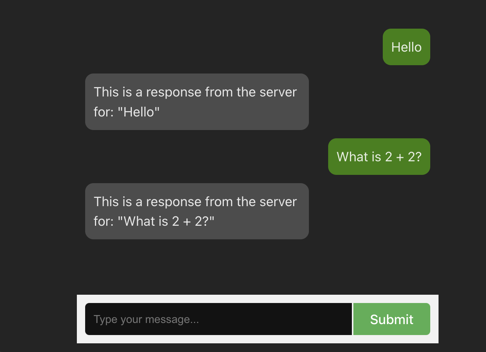

# LightCI LLM



## Setup Instructions

### Web (React TS)

```terminal
cd web
npm install
npm run dev
```

### API (Express JS)

```terminal
cd api
npm install
npm run dev
```

Note: add the provided OpenAI API key to the `api/.env` file

## Task Instructions

Your assignment is to integrate an LLM into this existing chat app. The feature should answer the user's question as if it were Abe Lincoln, and also filter the user question for only PG rated topics, otherwise a polite message response indicating "no answer" should be provided.
